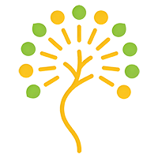

<div align="center">
	
    <p>
        <h1>阳光树成长伙伴系统 V1.0</h1>
    </p>
	<p align="center">
    	
    	
    	
    	
    	
    	
    	
    	
    	
    	
    	
    	
	</p>
	<p>&nbsp;</p>
</div>


#### 🌈 介绍

本产品将**免费面向全体小学生开放**，旨在通过游戏化、正向激励的方式，让每个孩子都能感受到：

- **被看见**——每一次努力和进步，都会被记录和鼓励
- **被陪伴**——有一个永远站在自己这边的小精灵伙伴
- **有期待**——通过自己的努力，让伙伴成长进化，解锁美好体验

核心理念：只传递美好，不制造焦虑；只记录进步，不标记失败。	

## 系统架构

### 技术栈选型

| 端侧       | 核心技术栈                                         |
| ---------- | -------------------------------------------------- |
| 前端 Web   | Vue 3.x + TypeScript + Vite + Pinia + Element Plus |
| 后端       | Go + Go Frame (GF) 框架                            |
| 移动端 APP | Flutter                                            |

### 架构设计

- **前端**：采用 Vue3 组合式 API + TypeScript 强类型约束，基于 Vite 实现快速构建，Pinia 做状态管理，Element Plus 提供组件支撑，遵循前后端分离架构，通过 RESTful API 与后端交互。
- **后端**：基于 Go Frame 高性能框架开发，提供接口服务、业务逻辑处理、数据持久化、权限控制等核心能力，支持高并发、易扩展。
- **移动端**：Flutter 跨端开发，一套代码适配 Android/iOS，提供轻量化的设备管理与操作入口。

### 技术选型一览表

| 模块       | 推荐方案                       | 备选方案            | 选型理由                        |
| ---------- | ------------------------------ | ------------------- | ------------------------------- |
| 后端框架   | Golang + Gin                   | Golang + Echo       | Gin 生态成熟，团队上手快        |
| 实时通信   | gorilla/websocket + lonng/nano | socket.io (Go port) | nano 专为游戏并发设计           |
| 消息广播   | Redis Pub/Sub                  | NATS                | Redis 已是基础依赖，减少组件数  |
| 数据库     | PostgreSQL                     | MySQL               | JSON 字段支持更好，事务更稳定   |
| 缓存       | Redis                          | Memcached           | 兼顾 Pub/Sub 与缓存两用         |
| 前端框架   | Taro + React                   | uni-app             | 更贴近 React 生态，组件复用率高 |
| 伙伴动画   | Lottie-web                     | CSS Animation       | 设计师可独立迭代动效            |
| 本地大模型 | Ollama + Qwen2.5               | 云端 API（备选）    | 数据不出校园，合规成本低        |
| PDF 生成   | chromedp                       | go-wkhtmltopdf      | HTML 模板还原度更高             |
| 容器编排   | Docker Compose                 | K3s（未来扩展）     | 适合单机部署，运维门槛低        |

## 核心功能

| 功能模块         | 详细说明                                                     |
| ---------------- | ------------------------------------------------------------ |
| 伙伴系统         | 每个孩子都有一个专属成长伙伴，包括宠物、二次元纸片人和植物   |
| 正向行为记录系统 | 行为维度（参考浙江师范大学附属小学"博雅积分"六维体系，并新增创新维度，包括**德馨（品德）**、**智睿（学习）**、**体健（运动）**、**美雅（艺术）**、**劳朴（劳动）**、**进步（努力）**、**创新（创造力）** |
| 伙伴对战系统     | 知识竞技场，对战不是为了分出胜负，而是让孩子在"玩"的过程中练习知识、展示所长。借鉴教育科技产品的对战设计，我们将对战定位为"趣味练习"，而非"竞技排名"。 |
| 互动广播系统     | 温暖提醒，包括伙伴对主人的广播、园长对全班的广播、广播内容设计原则 |
| 班级盲盒系统     | 惊喜奖励机制，创新设计了"班级盲盒"——学生用积分抽取"体验特权"而非实物奖品，结果带来了惊人的改变。 |
| 智能分层交互     | **高阶对话安全边界**：仅限学习、生活、情绪鼓励类话题，不开放自由闲聊。所有对话实时记录并由班主任/园长后台可审计；一旦检测到敏感词，自动切换至中阶预置回复模式。 |
| 园长系统         | 班主任端，负责查看全班伙伴成长概况、发送班级正向广播、设定"集体挑战"、管理"班级盲盒"奖励池等 |
| 家长端           | 可查看孩子的伙伴当前形态与进化历程、孩子获得的正向行为记录、孩子伙伴说过的鼓励话语、班级盲盒动态等 |
|                  |                                                              |

## 快速开始

### 环境要求

#### 前端

- Node.js ≥ 16.0.0
- pnpm/npm/yarn（推荐 pnpm）
- 浏览器：Chrome ≥ 88、Firefox ≥ 85、Edge ≥ 88

#### 后端

- Go ≥ 1.20
- Go Frame ≥ 2.0
- 数据库：MySQL ≥ 8.0 / PostgreSQL ≥ 14（可选）
- Redis ≥ 6.0（用于缓存、会话管理）

#### 移动端

- Flutter ≥ 3.10
- Android Studio / Xcode（对应移动端编译环境）
- Android ≥ 7.0 / iOS ≥ 12.0

### 部署步骤

#### 1. 后端部署

```bash
# 克隆代码仓库
git clone https://github.com/Hermyone/growth-partner
cd growth/service

# 安装依赖
go mod tidy

# 配置文件修改（数据库、Redis、端口等）
manifest/config/config.yaml

# 启动服务
go run main.go
# 或编译后运行
go build -o growth main.go
./growth
```

#### 2. 前端部署

```bash
cd growth/web

# 安装依赖
pnpm install

# 开发环境启动
pnpm dev

# 生产环境构建
pnpm build

# 预览构建结果
pnpm preview
```

#### 3. 移动端部署

```bash
cd growth/app

# 安装依赖
flutter pub get

# 启动模拟器并运行
flutter run

# 构建 APK（Android）
flutter build apk --release

# 构建 IPA（iOS，需 macOS 环境）
flutter build ios --release
```

## 接口文档

后端启动后，可访问 `http://localhost:9500/swagger` 查看自动生成的 Swagger 接口文档（需在后端配置中开启 Swagger 支持）。

## 开发规范

### 前端

- 遵循 Vue 3 组合式 API 开发规范，优先使用 `<script setup>`
- TypeScript 类型定义完整，避免 `any` 类型滥用
- 组件命名遵循 PascalCase，API 接口封装统一管理
- 样式使用 Element Plus 主题变量，保持风格统一

### 后端

- 遵循 Go Frame 开发规范，分层设计（控制器 - 服务 - 模型）
- 数据库操作使用 GF ORM，避免原生 SQL 硬编码
- 接口返回格式统一，包含 code、msg、data 字段
- 日志输出规范，关键操作记录日志

### 移动端

- 遵循 Flutter 官方开发规范，组件化、模块化开发
- 状态管理使用 Provider/Bloc，避免 setState 滥用
- 适配多分辨率设备，遵循移动端交互设计规范

## 常见问题

1. 前端启动报错：依赖安装失败

   解决方案：清理 npm 缓存，切换镜像源（如淘宝源），重新安装依赖。

2. 后端连接数据库失败

   解决方案：检查 config.yaml 中的数据库配置（地址、端口、用户名、密码），确保数据库服务已启动。

3. 移动端运行白屏

   解决方案：检查网络请求地址是否正确，确保后端服务已启动，检查 Flutter 版本与依赖兼容性。

## 许可证

本项目基于 MIT 许可证开源。
